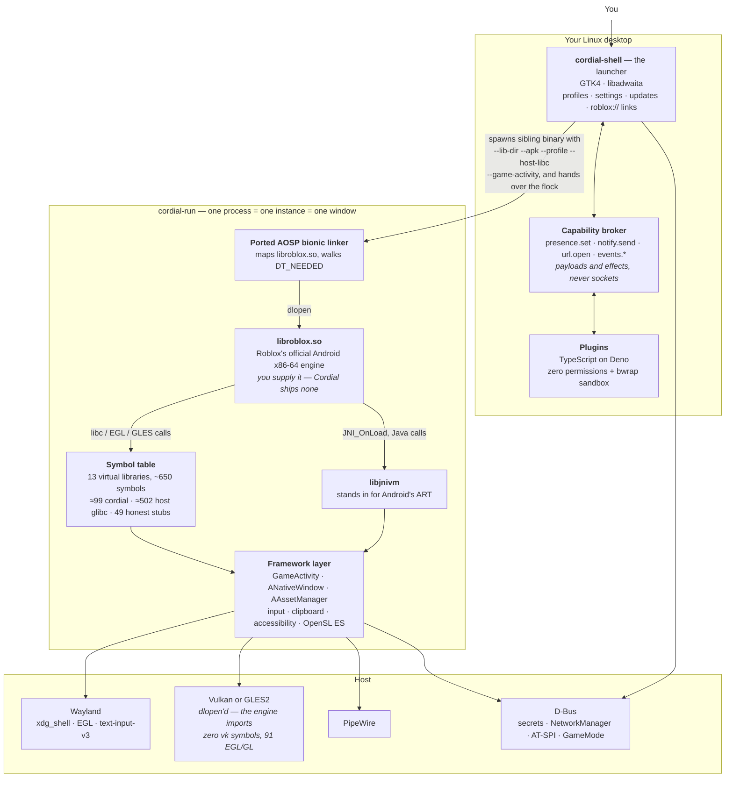

# How Cordial works

A map of the tree as it stands, not a specification. Where this and an ADR
disagree, the ADR is the decision and this is out of date — say so and fix it.

## What the arrows are saying

**Nothing points into the engine.** `libroblox.so` is mapped, relocated and
called, and that is all. Every arrow touching it points outward: the engine asks,
Cordial answers. There is no hooking, no patching and no injected script
environment — those are *absent* from the API rather than disabled, so a fork has
no primitive to re-enable ([ADR-001](adr/ADR-001-in-process-hooking.md),
[ADR-003](adr/ADR-003-plugin-isolation.md)).

**The symbol table is the whole trick.** Every name the engine imports resolves
one of three ways, and the split is printed at startup so it can be checked
rather than assumed:

| route | what it means |
|---|---|
| **cordial** | Cordial implements it, because Android's version does something Linux's does not |
| **host** | forwarded straight to the host's glibc (`--host-libc`) |
| **stub** | not implemented, and it **reports failure** rather than faking success |

That third row is a rule, not an accident. A stub returning success sends the
engine off on an answer that is not true, and it fails somewhere with no
relationship to the cause. `native/opensles.cpp` returning
`SL_RESULT_FEATURE_UNSUPPORTED` instead of a dead engine object is the pattern.

**The renderer is chosen by absence.** The engine imports *zero* Vulkan symbols
and 91 EGL/GL ones — it picks its backend with `dlopen` at runtime. So selecting
GLES means withholding the virtual `libvulkan` soname; there is no flag for it.
`FStringDebugGraphicsPreferredBackend` was measured to be inert and the code that
set it was deleted.

**Plugins never reach the middle box.** They talk to the broker, which holds the
permission and performs the effect — `presence.set` takes a presence structure
and Cordial owns the Discord socket ([ADR-007](adr/ADR-007-host-resources-are-brokered.md)).
The `bwrap` layer under Deno can only ever *subtract*
([ADR-018](adr/ADR-018-plugin-sub-sandboxing.md)).

**One process is one window is one profile.** A profile is storage; an instance
is a window. The shell takes an `flock` on the profile and hands the descriptor
to the child, so the client itself holds it for its lifetime. Multiple clients
are unrestricted; two clients on *one* profile are refused, because two processes
writing one `appData` and one cookie store corrupts Roblox's storage
([ADR-012](adr/ADR-012-profiles-and-instances.md)).

## What the diagram leaves out

The engine's own network stack. Cordial does not proxy, inspect or rewrite it —
Roblox's cURL talks to Roblox directly, and `RtcIoRna`, the real-time game
transport, is not HTTP at all. That is why there is no `http_proxy`-shaped
setting and why the per-profile VPN gate is a launch gate rather than a tunnel
([ADR-016](adr/ADR-016-per-profile-network-egress.md)).
